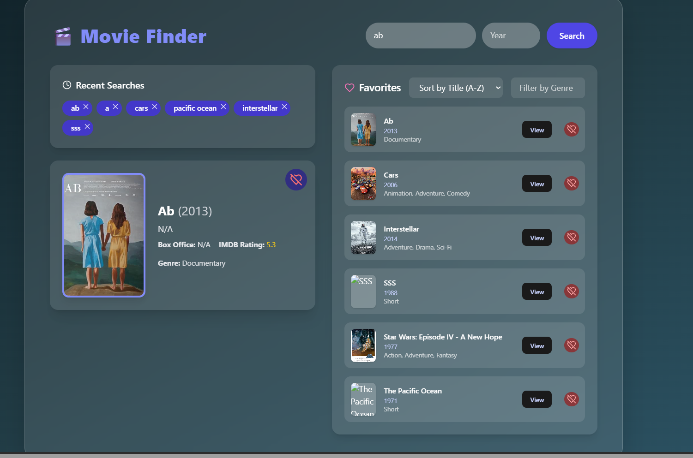

# 🎬 Movie Finder

📌 **Introduction**  
Movie Finder is a modern React + TypeScript application to search and explore movies using the OMDb API. Users can view movie details, watch trailers via YouTube, and manage a list of favorite movies with sorting and filtering features.



---

## 🧰 Technologies Used

### 🎨 Frontend
- **React 19** – UI library for building interactive interfaces.
- **TypeScript** – Superset of JavaScript that adds static typing.
- **Vite** – Fast frontend build tool and development server.
- **Tailwind CSS** – Utility-first CSS framework for styling.
- **Lucide React** – Icon library with React components.
- **React YouTube** – Embeds YouTube videos (used for trailers).
- **Axios** – Promise-based HTTP client for making API requests.

### 🖥 Backend (API Integration)
- **OMDb API** – RESTful API providing movie details and metadata.
- **Google YouTube Data API** – Used to fetch and embed movie trailers.

### 🛠 Tooling & Build
- **ESLint** – Linter to catch code issues and enforce best practices.
- **PostCSS + Autoprefixer** – CSS tooling to support modern CSS features.
- **TypeScript ESLint** – Ensures TypeScript code quality and linting.
- **Vite React Plugin** – Enables React support with Vite.

---

## ⚙️ APIs Used
- **OMDb API** – For fetching movie data (title, plot, ratings, etc.)
- **Google API** – For searching and embedding trailers via YouTube Data API

---

## 🔧 Features

- 🔍 Search movies by title
- 📆 Optional year filter
- 🎥 View trailers via YouTube, currently picking the trailer using the Movie Title,year, genre, cast.
- 📊 Display plot, box office, IMDb rating, and more
- 🌙 Clean and responsive UI
- 🎯 Filter by genre and sort by title, rating or more

---

## 🚀 Getting Started

### 1. Clone the repository

```bash
git clone https://github.com/your-username/movie-app.git
cd movie-app
```

### 2. Install dependencies

```bash
npm install
```

### 3. Configure environment variables

Update a `.env` file in the root directory and add your API keys:

```env
VITE_OMDB_API_KEY=your_omdb_api_key
VITE_GOOGLE_API_KEY=your_google_api_key
```

> 🔑 You can get the OMDb API key from [http://www.omdbapi.com/apikey.aspx](http://www.omdbapi.com/apikey.aspx)  
> 🔑 You can get a Google API key from [https://console.cloud.google.com/](https://console.cloud.google.com/) and enable the **YouTube Data API v3**

---

🔐 Obtaining API Keys

🎟️ OMDb API Key

Go to https://www.omdbapi.com/apikey.aspx

Choose a plan (free or paid)

Enter your email and submit

Receive API key via email

Add to your .env as VITE_OMDB_API_KEY

📺 Google API Key (YouTube Data API)

Go to Google Cloud Console

Create/select a project

Go to APIs & Services > Library

Enable YouTube Data API v3

Go to APIs & Services > Credentials

Click Create Credentials → API key

Restrict your API key if needed

Add to your .env as VITE_YOUTUBE_API_KEY

### 4. Start the development server

```bash
npm run dev
```

### 5. Build for production

```bash
npm run build
```

---

## 📄 Notes

- This app relies on external APIs, so ensure your API keys have sufficient quota.
- YouTube trailers are retrieved using Google’s Search API and are embedded via `react-youtube`.
- No user authentication or backend server is required.
