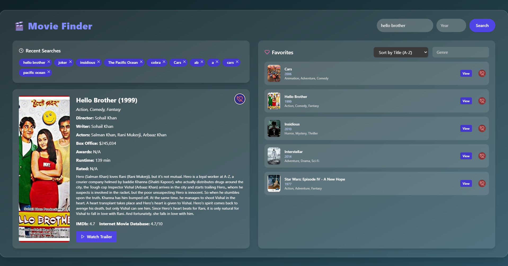

# 🎬 Movie App

A simple React + TypeScript application to search movies using the OMDb API.



## 🔧 Features

- Search movies by title
- Optional year filter
- View movie plot, box office, IMDb rating
- Clean and responsive UI

## 🚀 Getting Started

### 1. Clone the repo

```bash
git clone https://github.com/your-username/movie-app.git
cd movie-app
